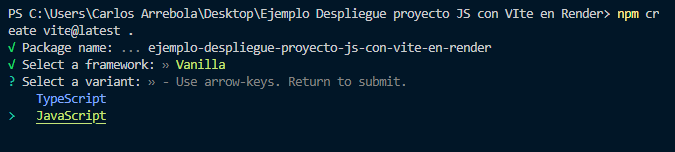
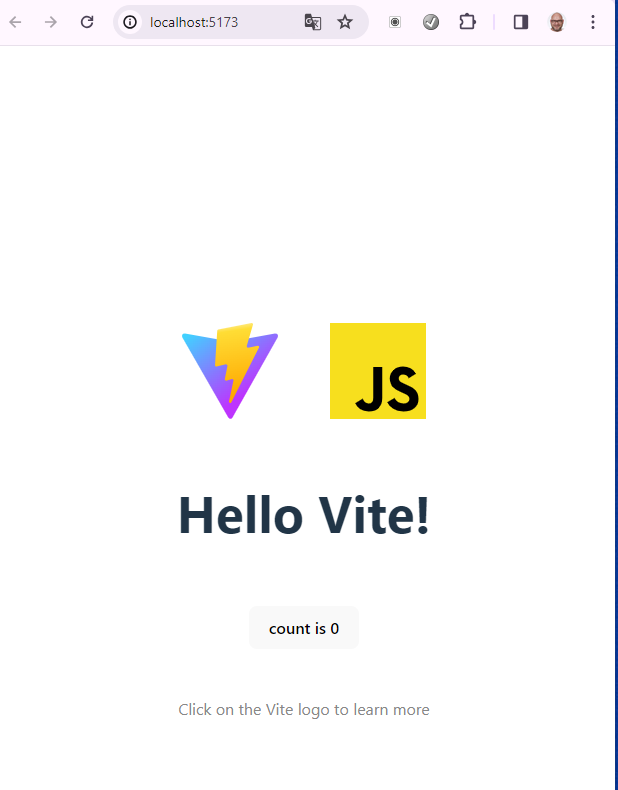
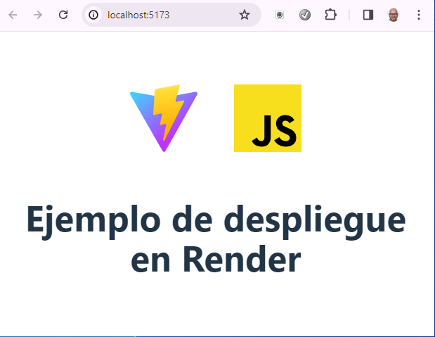
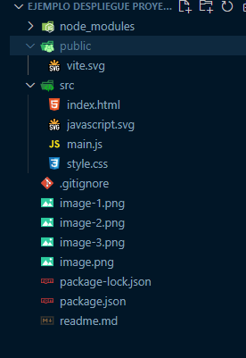
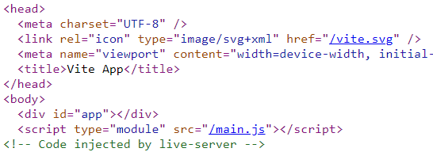

# Ejemplo de despliegue de proyecto basado en Vanilla Javascript creado a partir de Vite

## Creando el proyecto
1. Creamos carpeta y abrimos con VSCode
2. Creamos proyecto con:
   
   ``` 
   npm create vite@latest . 
   ``` 
3. Configuramos el proyecto:
   
   

4. Instalamos las dependencias con `npm  install` y visualizamos con servidor virtual de Vite: `npm run dev`


5. Modificamos componentes del ejemplo para que muestre el siguiente aspecto:
   

## Modificando scafolding (estructura de carpetas)
Vamos a meter todos nuestros archivos en la carpeta `src` y todas las imagenes en la carpeta `public`que tenemos en la raiz.


*(No hagas caso a carpeta tutorial. Esta contiene las imágenes de este tutorial)*

6. Ahora necesitamos decirle a Vite que el archivo `index.html` está en la carpeta `src`. Esto lo hacemos mediante el archivo `vite.config.js`

```
import { defineConfig } from "vite";

export default defineConfig({
  root: "./src",   // Indicamos que la raiz de nuestro proyecto es la carpeta src
  base: "./", // Indicamos que use el . para indicar la carpeta actual
  publicDir: "../public", // Indicamos donde tendremos los archivos públicos, como imágenes, etc
  build: {
    outDir: "../dist", // Indicamos donde queremos que se cree la carpeta de distribución 
    assetsDir: "assets"
  },
  plugins: []
});
```

*Fíjate que también le hemos indicado donde se va a generar la carpeta de distribución y la carpeta con los archivos públicos.*

7. Para que se aplique la configuración debes cerrar el servidor `ctrl+C` y volver a ejecutarlo `npm run dev`

## Imágenes en carpeta publica
8. Ahora vamos a probar de poner una imagen en la carpeta publica 'logoVanilla.svg' y a utilizarla desde `main.js`
```

```
*fíjate que con solo poner `/`ya le estamos indicando que mire en la carpeta `public`.*


## Creando la carpeta de distribución

Para crear la carpeta de distribución ejecutamos `npm run build`. Verás que la carpeta `dist`se ha creado en la raiz del proyecto.

Para ver en servidor de prueba el resultado de esta distribución ejecutamos `npm run preview`. Verás que se ejecuta en un servidor nuevo.

Vamos a hacer una última comprobación utilizando el servidor virtual de la extensión `live server`.

Al ejecutar este servidor comprobamos que no se muestra la web. Si miramos el código con el inspector verás que las urls comienzan con '/' y no con './'. 



